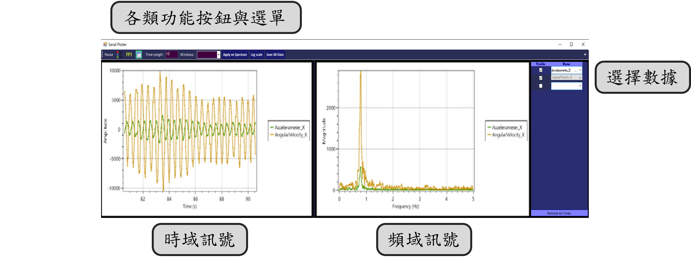

<!--底下標籤來源參考寫法可至：https://github.com/Envoy-VC/awesome-badges#github-stats -->

## 介紹

主要功能為**即時顯示掃描時的點雲數據**，其他輔助功能還包含**串口序列埠、串口圖像序列埠、光學位移感測之影像輸出、讀取各類型點雲數據**以及**串口控制感測設備**，下列將依上圖中顯示的各區塊詳述其功能：
> ps. 需與本研究自主開發的 3D 點雲擷取設備搭配使用

### 其他輔助工具區

- **讀取各類型點雲數據：** 可讀取常見的點雲儲存格式，例如 | * *.ply |* * *.obj* | *  *.pcd* | * *.txt*。

- **串口序列埠：** 即時顯示串口上讀取到的數據資料。

- **串口圖像序列埠：** 即時將串口上的數據資料以**折線圖**的圖表方式呈現。顯示內容還可即時輸出頻譜分析數據，亦可依據連續時間擷取時域與頻域數據，以利後續進一步分析處理。

- **光學位移感測之影像輸出：** 讀取滑鼠光學位移感測器上的即時影像，同步還可檢視設備目前的狀態參數，例如表面特徵數、畫面平均亮度、影格數 (Frame Rate) 等。
> 目前僅接受 30 X 30 像素 (pixel) 的畫面輸出。

- **數據分析表：** 針對感興趣的數據來顯示。

### 裝置功能區
此區會依據操作流程區內不同的掃描模式，更改顯示的功能頁面

|  | 
功能描述
|
| ------ | -------- |
| 頁面 1   | 包含串口通訊設置與校正慣性感測器與光學位移感測器的功能按鈕|
| 頁面 2   | 掃描模式切換 (2D、3D)、掃描開始\暫停\清除點雲等功能按鈕、3D 點雲擷取設備|
| 頁面 3   | 點雲數據預處理|
| 頁面 4   | 輸出特定格式的點雲數據檔案|

&emsp;

### 狀態顯示
顯示操作本系統的執行日誌，用以確認當下執行流程與程式執行狀態

### 操作流程區
從左至右依序執行點雲掃描流程，從一開始的基礎設定 **`"Setting"`**，接續掃描點雲數據的 **`"Scan"`**，掃描後的點雲數據預處理 **`"Curve/Filting"`**，最後依特定格式輸出的 **`"Output"`**
> 滑鼠控件移至圓形圖標上，觸發響應使顏色變更為深綠色，亦可點擊圓形圖標來改變掃描流程

### 點雲顯示區

讀取的點雲、掃描當下的點雲皆會在此區塊內顯示，畫面左下可顯示當下座標系的旋轉結果；右下則可透過頁面 2 的 `Scalar Bar`選擇是否顯示標量條。

> 標量條的數值皆為歸一化後的結果，依據感測到的 Z 軸座標值最大與最小進行計算

> 透過顏色區別不同 Z 軸數據的大小，可協助使用者更直覺地分辨三維空間的深度

## 技術架構

 &nbsp;&nbsp;  &nbsp;&nbsp;  &nbsp;&nbsp;  

## 第三方開源函式庫
 &nbsp;  &nbsp;  &nbsp;  &nbsp;  

## 聯絡作者、後記

>如有疑問或是建議，歡迎隨時在論壇內發布消息或寄送電子郵件至 kenny3271879@gmail.com。如要回報技術上的錯誤，也可在 Github 上提交問題。

 