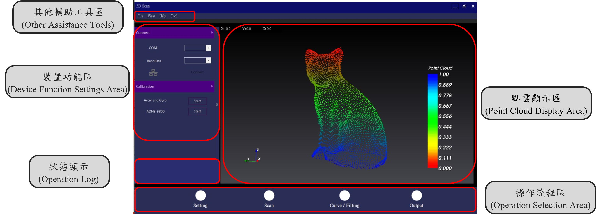
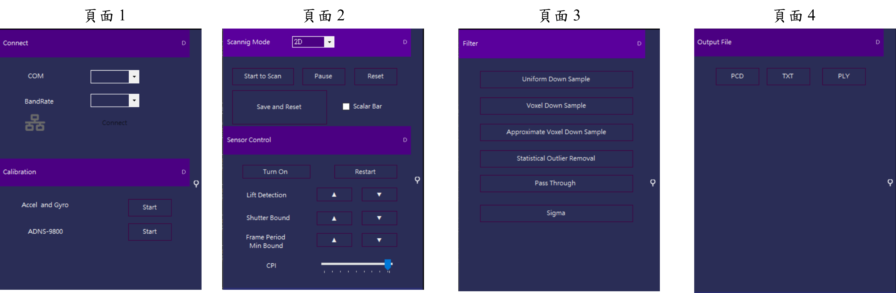

<!--底下標籤來源參考寫法可至：https://github.com/Envoy-VC/awesome-badges#github-stats -->


>技術架構 <div style="text-align:center;vertical-align:bottom"> &nbsp;  &nbsp;  &nbsp; </div>

## 介紹



主要功能為`即時顯示掃描時的點雲數據`，其他輔助功能還包含**串口序列埠、串口圖像序列埠、光學位移感測之影像輸出、讀取各類型點雲數據**以及**串口控制感測設備**，下列將依上圖中顯示的各區塊詳述其功能：

### 其他輔助工具區
- 讀取各類型點雲數據：可讀取常見的點雲儲存格式，例如 | * *.ply |* * *.obj* | *  *.pcd* | * *.txt*。

- 串口序列埠：即時顯示串口上讀取到的數據資料。

- 串口圖像序列埠：即時將串口上的數據資料以**折線圖**的圖表方式呈現。

- 光學位移感測之影像輸出：讀取滑鼠光學位移感測器上的即時影像，目前僅接受 30 X 30 像素 (pixel) 的畫面輸出。

- 數據分析表：針對感興趣的數據來顯示。


### 裝置功能區
依據不同掃描流程，此區會顯示不同功能頁面


|  | <div style="text-align:center; vertical-align:bottom;">功能描述</div>|
| ------ | -------- |
| 頁面 1   | 包含串口通訊設置與校正慣性感測器與光學位移感測器的功能按鈕|
| 頁面 2   | 掃描模式切換 (2D、3D)、掃描開始\暫停\清除點雲等功能按鈕、3D 點雲擷取設備|
| 頁面 3   | 點雲數據預處理|
| 頁面 4   | 輸出特定格式的點雲數據檔案|

&emsp;

### 狀態顯示
顯示操作本系統的執行日誌，用以確認當下執行流程與程式執行狀態
### 操作流程區
從左至右依序執行點雲掃描流程，從一開始的基礎設定 `"Setting"`，接續掃描點雲數據的 `"Scan"`，掃描後的點雲數據預處理 `"Curve/Filting"`，最後依特定格式輸出的 `"Output"`
### 點雲顯示區
顯示操作本系統的執行日誌，用以確認當下執行流程與程式執行狀態


> ps. 需與本研究自主開發的 3D 點雲擷取設備搭配使用

## 功能


## 第三方開源函式庫
 &nbsp;  &nbsp;  &nbsp;  &nbsp;  

## 功能

測試帳號密碼 **（請斟酌提供，建議只提供僅能觀看不能操作的帳號密碼）**

```bash
帳號： example@example.com
密碼： example
```

- [x] 登入
- [x] 登出
- [x] 產品列表
...

## 畫面

> 可提供 1~3 張圖片，讓觀看者透過 README 了解整體畫面


## 安裝

> 請務必依據你的專案來調整內容。

以下將會引導你如何安裝此專案到你的電腦上。

Node.js 版本建議為：`16.15.0` 以上...

### 取得專案

```bash
git clone git@github.com:hsiangfeng/README-Example-Template.git
```

### 移動到專案內

```bash
cd README-Example-Template
```

### 安裝套件

```bash
npm install
```

### 環境變數設定

請在終端機輸入 `cp .env.example .env` 來複製 .env.example 檔案，並依據 `.env` 內容調整相關欄位。

### 運行專案

```bash
npm run serve
```

### 開啟專案

在瀏覽器網址列輸入以下即可看到畫面

```bash
http://localhost:8080/
```

## 環境變數說明

```env
APIPATH= # API 位置
COUSTOMPATH= # 自訂變數
...
```

## 資料夾說明

- views - 畫面放置處
- controllers - 控制器放置處
- modules - 模組放置處
- assets - 靜態資源放置處
  - scss - scss 檔案放置處
  - images - 圖片放置處
...

## 專案技術

- Node.js v16.15.0
- Vue v3.2.20
- Vite v4.0.4
- Vue Router v4.0.11
- Axios v0.24.0
- Bootstrap v5.1.3
...

## 第三方服務

- Algolia
- Google Analytics
...

## CI/CD 說明

此專案有使用 Github Actions，所以發起 PR 時會自動執行以下動作：

- 建立 Node.js 環境
- 安裝相依套件
- 編譯程式碼
- 執行 ESLint 掃描
- 執行測試
...

當專案 merge 到 main 時會自動執行以下動作：

- 建立 Node.js 環境
- 安裝相依套件
- 編譯程式碼
- 執行 ESLint 掃描
- 執行測試
- 部署到 Github Pages
...

## 聯絡作者

> ps. 這邊絕對不是業配，而是要適當提供一些方式讓觀看者知道你的聯絡方式，讓他們可以更方便的找到你。

你可以透過以下方式與我聯絡

- [部落格](https://israynotarray.com/)
- [Facebook](https://www.facebook.com/israynotarray)
- [Instagram](https://www.instagram.com/isray_notarray/)
...
